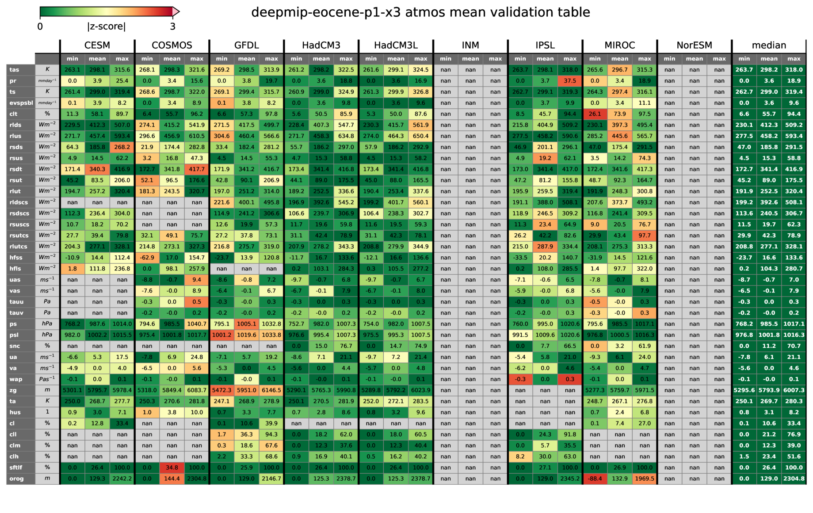

# deepmip-helpers
Collection of scripts and dictionaries for interacting with DeepMIP data. They are intended to streamline both generation and analysis of standardised DeepMIP output data. More information about the naming convention
is available in this [preprint](https://sebsteinig.github.io/assets/pdf/DeepMIP-Eocene_model_database_descriptor.pdf).


## dictionaries
The dictionaries contain information about models and experiments of individual DeepMIP ensembles, as well as an overview of all defined variables. These dictionaries are continously updated with new model simulations and DeepMIP phases and can be used for a scripted analysis of the DeepMIP data sets.

## scripts
#### `regrid_deepmip_data.py`
Interpolates global netCDF files from the DeepMIP data sets to a common horizontal grid. It uses the Climate Data Operators (CDO) tool to perform regridding for a list of specified variables for all available models and experiments of the respective DeepMIP ensemble making use of the defined naming conventions and metadata dictionaries.

#### `plot_z_scores.py`
Simulates a standard analysis workflow to check the internal consistency of the DeepMIP database and produces overview tables (see below). Inputs files are global netCDF files and the results are displayed in overview tables for each DeepMIP experiment.
Processing steps include:
- construct filenames for each DeepMIP experiment, model and variable combination
- check if specific files exist
- regridding models to a common grid using CDO
- calculate the global mean/min/max of regridded files
- performing sanity checks on resulting netCDF files
- select consistent vertical levels for each variable
- compare global mean values across the DeepMIP ensemble
- generate an overview table per experiment listing results for all variables and models
- all tables are process in parallel using ProcessPoolExecutor to speed up total computation time



## example usage
Let's recreate the overview tables for the DeepMIP-Eocene-p1 data set (see figure above) from scratch using `plot_z-scores.py`.

1. Install dependencies: Dependencies for all scripts are listed in the individual files. Easiest way to run locally is to create a new conda environment with:
    ``` bash
    conda env create --name deepmip-helpers --file environment.yml
    ```
    and then activate this environment:
    ``` bash
    conda activate deepmip-helpers
    ```
2. Download data set: Download the complete `deepmip-eocene-p1` data set to your local machine with:
    ``` bash
    wget -e robots=off --mirror --no-parent -r -c https://dap.ceda.ac.uk/badc/cmip6/data/CMIP6Plus/DeepMIP/deepmip-eocene-p1/
    ```
3. Create tables: Set the `DBDIR` variable in `plot_z-scores.py` to the path of your newly downloaded data set, then start the parallel processing and plotting of all experiments with:  
    ``` bash
    python3 plot_z-scores.py
    ```
    The script will show a progress bar and all tables will be saved to `<DBDIR>/validation_tables/`.
